<a href="https://lexandro-design.github.io/portfolio/"><picture><source media="(prefers-color-scheme: dark)" srcset="assets/hero-dark.png">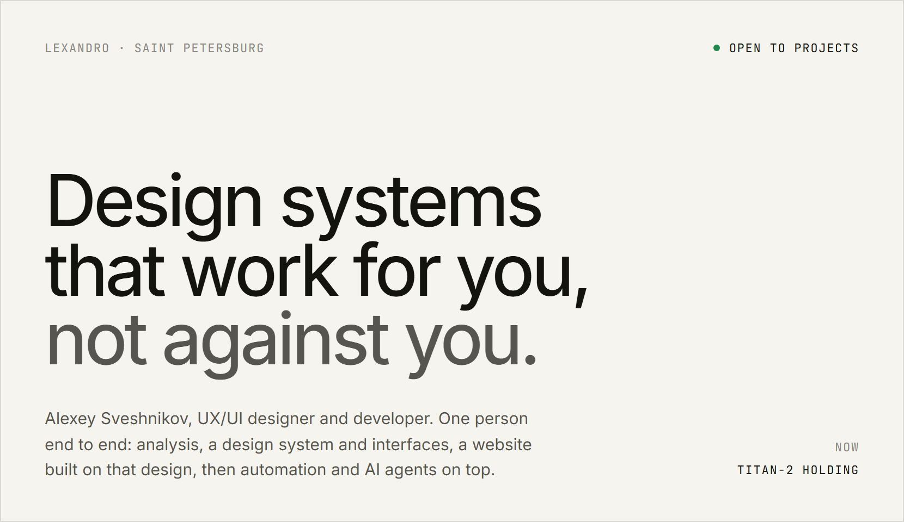</picture></a>

<a href="https://lexandro-design.github.io/portfolio/"><b>Portfolio</b></a>&nbsp;&nbsp;·&nbsp;&nbsp;<a href="https://t.me/lexandr0">Telegram</a>&nbsp;&nbsp;·&nbsp;&nbsp;<a href="mailto:alexssveshnikov@gmail.com">Email</a>

<picture><source media="(prefers-color-scheme: dark)" srcset="assets/label-approach-dark.png">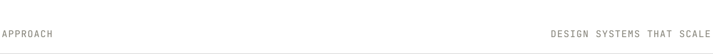</picture>
<picture><source media="(prefers-color-scheme: dark)" srcset="assets/approach-dark.png">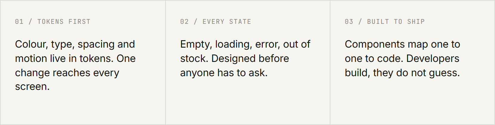</picture>

<picture><source media="(prefers-color-scheme: dark)" srcset="assets/label-works-dark.png">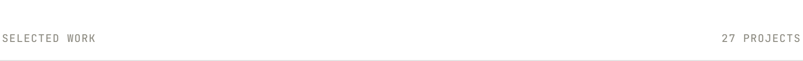</picture>
<a href="https://lexandro-design.github.io/portfolio/cases/parfumeria/"><picture><source media="(prefers-color-scheme: dark)" srcset="assets/case-parfumeria-dark.png">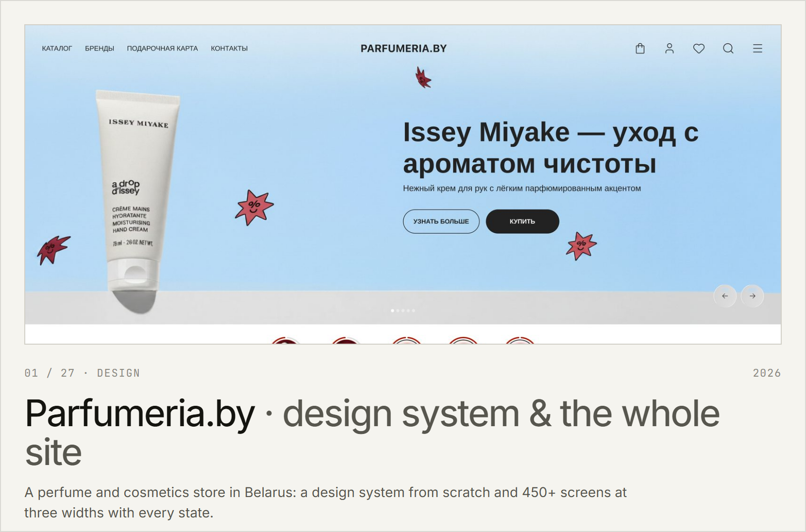</picture></a>

<a href="https://lexandro-design.github.io/portfolio/cases/meeting-rooms/"><picture><source media="(prefers-color-scheme: dark)" srcset="assets/case-meeting-rooms-dark.png">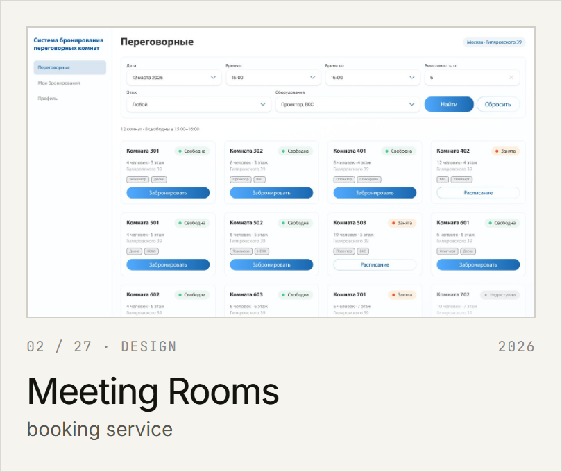</picture></a> <a href="https://lexandro-design.github.io/portfolio/cases/mimimibot/"><picture><source media="(prefers-color-scheme: dark)" srcset="assets/case-mimimibot-dark.png">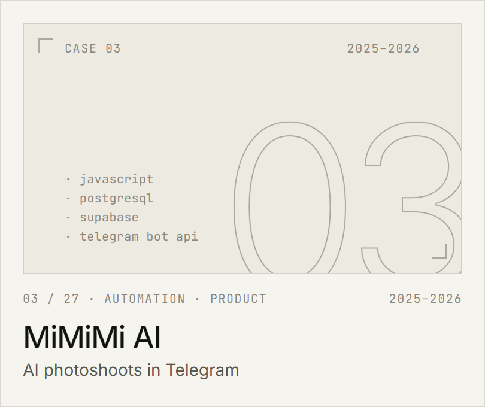</picture></a>

<a href="https://lexandro-design.github.io/portfolio/cases/otrx/"><picture><source media="(prefers-color-scheme: dark)" srcset="assets/case-otrx-dark.png">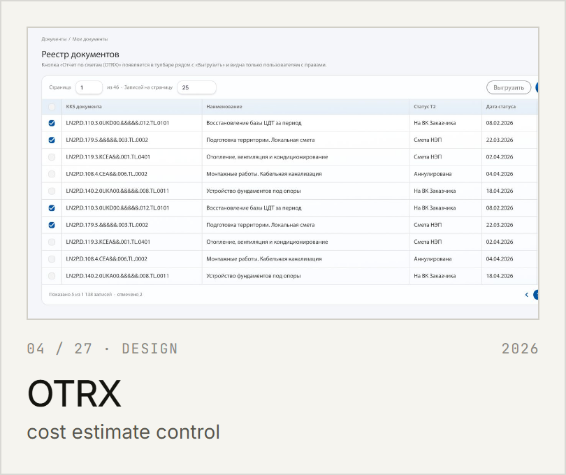</picture></a> <a href="https://lexandro-design.github.io/portfolio/cases/food-assistants/"><picture><source media="(prefers-color-scheme: dark)" srcset="assets/case-food-assistants-dark.png">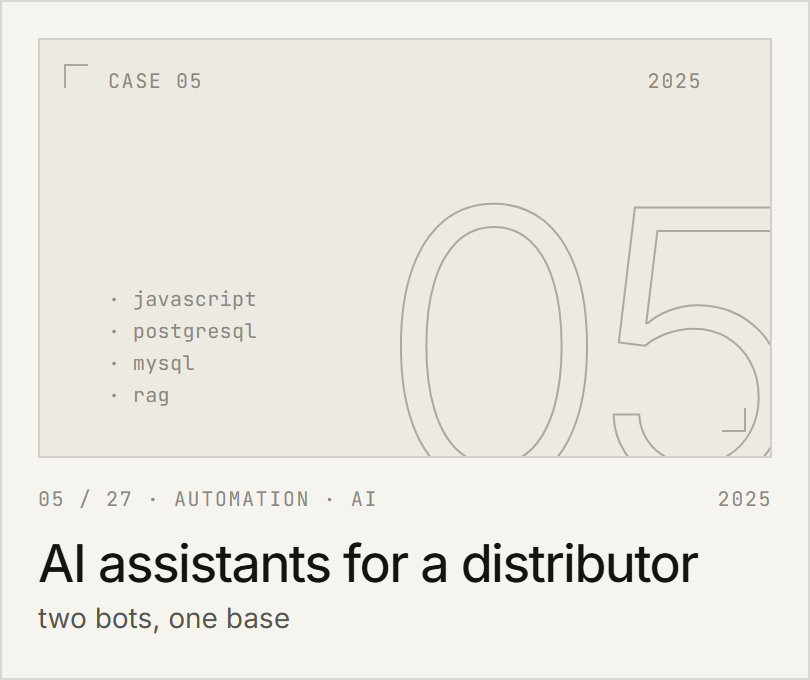</picture></a>

<a href="https://lexandro-design.github.io/portfolio/cases/meg-site/"><picture><source media="(prefers-color-scheme: dark)" srcset="assets/case-meg-site-dark.png">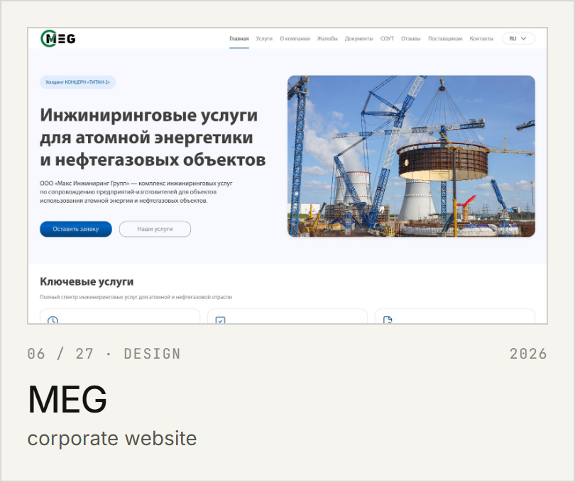</picture></a> <a href="https://lexandro-design.github.io/portfolio/cases/osq/"><picture><source media="(prefers-color-scheme: dark)" srcset="assets/case-osq-dark.png">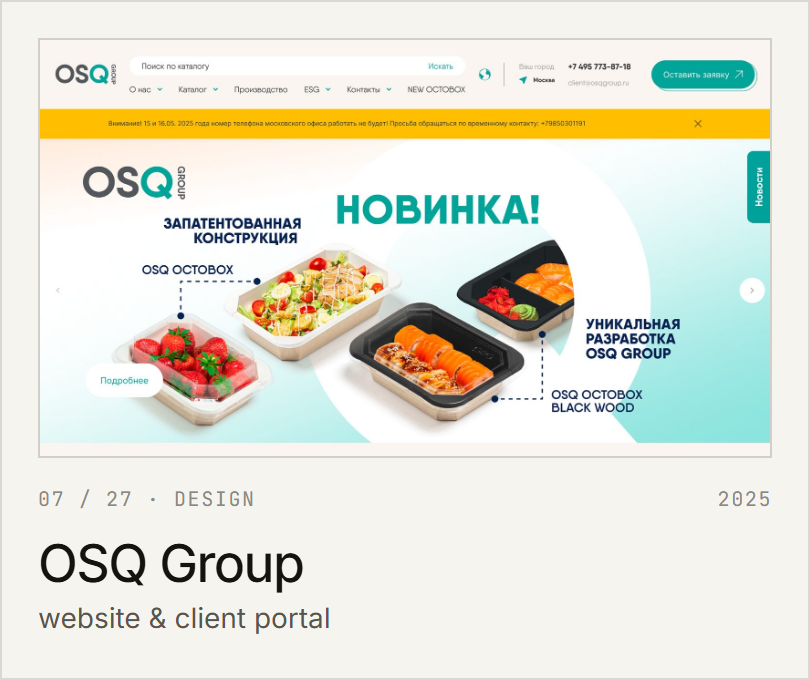</picture></a>

<a href="https://lexandro-design.github.io/portfolio/cases/svarnoy52/"><picture><source media="(prefers-color-scheme: dark)" srcset="assets/case-svarnoy52-dark.png">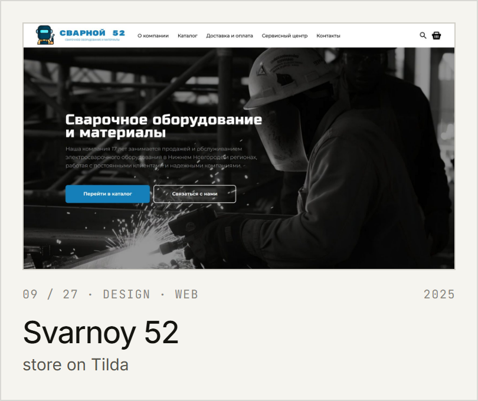</picture></a> <a href="https://lexandro-design.github.io/portfolio/cases/ai-translator/"><picture><source media="(prefers-color-scheme: dark)" srcset="assets/case-ai-translator-dark.png">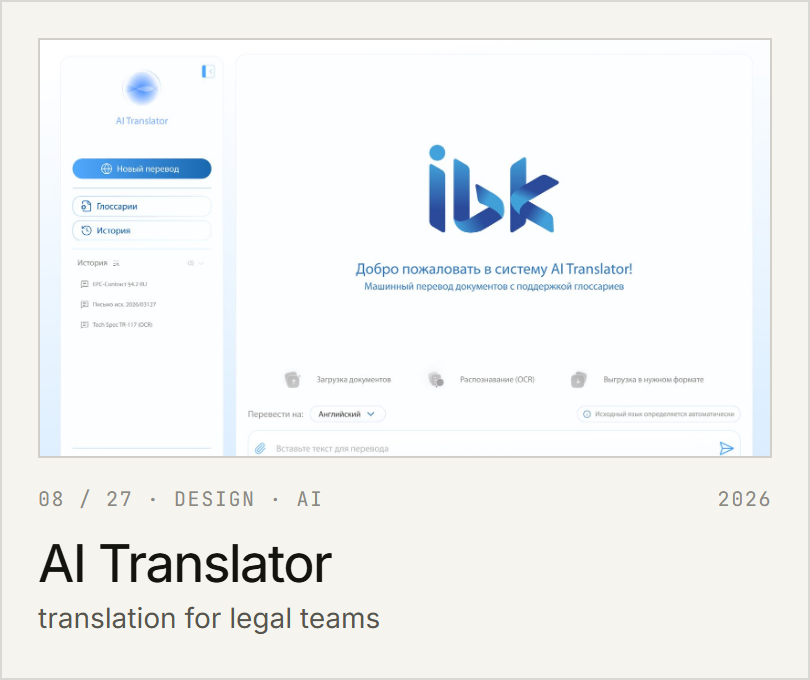</picture></a>

<picture><source media="(prefers-color-scheme: dark)" srcset="assets/label-stack-dark.png">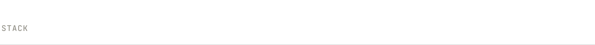</picture>
<picture><source media="(prefers-color-scheme: dark)" srcset="assets/stack-dark.png">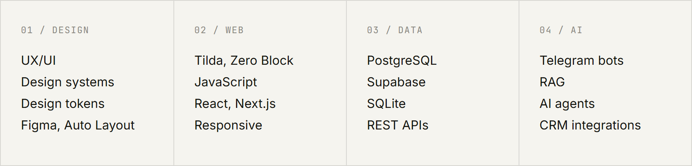</picture>

<a href="mailto:alexssveshnikov@gmail.com"><picture><source media="(prefers-color-scheme: dark)" srcset="assets/contact-dark.png">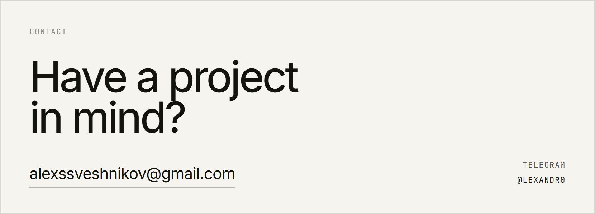</picture></a>
