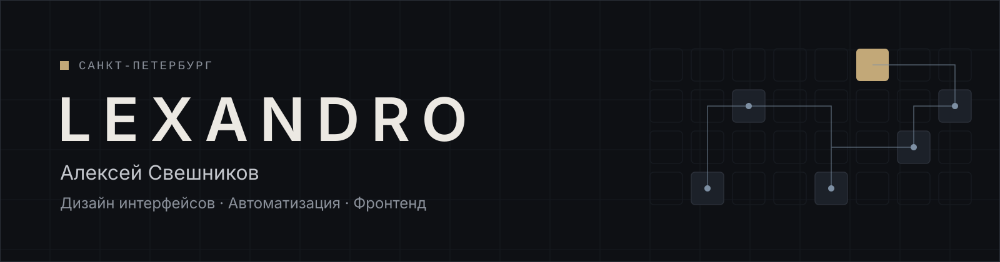

Проектирую интерфейсы и автоматизирую процессы: от дизайн-системы в Figma до работающего кода на Next.js и сценариев в n8n.

Работаю в холдинге ТИТАН-2: дизайн интерфейсов и автоматизация внутренних процессов. Отдельно беру проекты на фрилансе.

### Чем занимаюсь

- **Дизайн интерфейсов** — дизайн-системы, библиотеки компонентов, макеты в Figma на нескольких брейкпоинтах
- **Автоматизация и AI** — сценарии в n8n, Supabase / PostgreSQL, Telegram-боты, RAG, AI-агенты и MCP-серверы
- **Фронтенд** — React, TypeScript, Next.js (App Router), CSS Modules

### Стек

**Дизайн** 

**Автоматизация и AI** 

**Фронтенд** 

### Избранные проекты

<table>
  <tr valign="top">
    <td width="50%">
      
       <b><a href="https://github.com/lexandro-design/portfolio/tree/main/cases/parfumeria">Parfumeria.by</a></b>
       Интернет-магазин парфюмерии: дизайн-система, 450+ экранов в Figma, перенос на Next.js с headless-каталогом из Битрикса
       Figma · Next.js · TypeScript · CSS Modules
    </td>
    <td width="50%">
      
       <b><a href="https://github.com/lexandro-design/portfolio/tree/main/cases/mimimibot">MiMiMi AI</a></b>
       Telegram-бот для AI-фотосессий с цифровым двойником пользователя
       n8n · Supabase · YooKassa · Telegram Bot API
    </td>
  </tr>
  <tr valign="top">
    <td width="50%">
      
       <b><a href="https://github.com/lexandro-design/portfolio/tree/main/cases/jarvis">Jarvis</a></b>
       Личный self-hosted ассистент в Telegram: текст, голос, напоминания по расписанию
       n8n · Supabase · OpenAI · Telegram Bot API
    </td>
    <td width="50%">
      
       <b><a href="https://github.com/lexandro-design/portfolio/tree/main/cases/brain-search">brain-search</a></b>
       Локальный MCP-сервер семантического поиска по базе знаний для Claude Code
       MCP · RAG · Ollama · Hybrid Search
    </td>
  </tr>
</table>

Все кейсы — в репозитории [portfolio](https://github.com/lexandro-design/portfolio) и на [сайте](https://lexandro-design.github.io/portfolio/).

### Контакты

- Telegram: [@lexandr0](https://t.me/lexandr0)
- Email: [alexssveshnikov@gmail.com](mailto:alexssveshnikov@gmail.com)
- Сайт: [lexandro-design.github.io/portfolio](https://lexandro-design.github.io/portfolio/)
